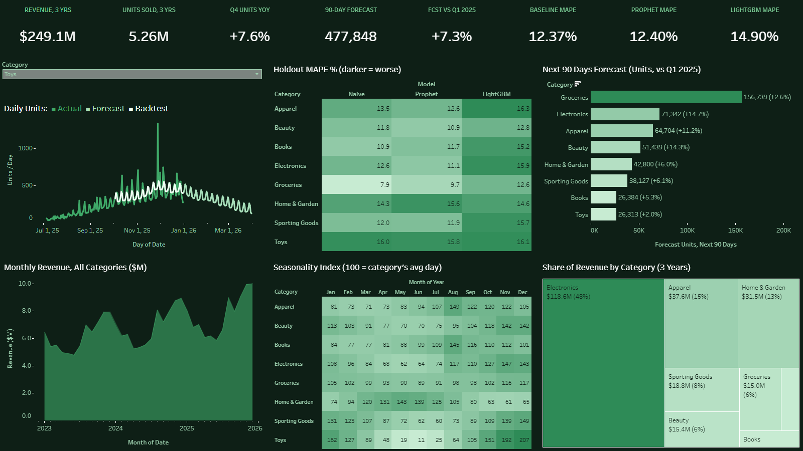

# Sales Demand Forecasting

Forecasts daily unit sales for 8 product categories 90 days ahead and compares Prophet, LightGBM and a seasonal-naive baseline on a 90-day holdout. The pipeline streams the sales history through Kafka, validates it with Great Expectations, aggregates it with Spark, models it with dbt, and ends with a demand-planning report written by a local LLM (Ollama) from pre-computed facts, plus Excel and Tableau dashboards generated from code.

[](https://public.tableau.com/app/profile/palaksh.chaturvedi/viz/Sales_Forecast_17909479861830/SalesDemandForecastingOverview)

**[Open the interactive dashboard on Tableau Public](https://public.tableau.com/app/profile/palaksh.chaturvedi/viz/Sales_Forecast_17909479861830/SalesDemandForecastingOverview)**

## Results (90-day holdout, mean of 8 categories)

| Model | Mean MAPE | Mean RMSE |
|---|---|---|
| **Seasonal naive** (same weekday last year x growth) | **12.37%** | **146.8** |
| Prophet (CV-tuned trend, US holidays) | 12.40% | 206.4 |
| LightGBM (direct 90-day model, every lag 90+ days) | 14.90% | 230.4 |

**The honest finding:** no model beats the seasonal-naive baseline. Prophet ties it on MAPE and loses on RMSE in every category. Two earlier, better-looking numbers were audit bugs: Prophet had been given the generator's own spike dates as holidays (8.57% MAPE), and LightGBM was secretly forecasting one day ahead (13.53%).

**Known weak spots:** the data is synthetic and built in Prophet's own multiplicative form; the forecast models use only the date and the sales history.

## Pipeline

```
data/raw/sales_history.csv -> Kafka producer/consumer (idempotent, 20k rows per run)
  -> Great Expectations -> Spark over JDBC (daily totals, rolling windows) -> dbt (23 tests)
  -> Prophet + LightGBM + seasonal naive -> LLM report (llama3.2 via Ollama, facts computed in code)
  -> Excel + Tableau dashboards
```

11 Airflow tasks, triggered by hand. Stack: Docker Compose, Kafka 7.5.3 + ZooKeeper, Spark 3.5, Airflow 2.9.3, PostgreSQL 15, Great Expectations 0.18.19, dbt 1.7.13, Prophet 1.1.5, LightGBM, Ollama, openpyxl, Tableau Hyper API.

## Run it

```
cp .env.example .env            # set POSTGRES_PASSWORD and HOST_PROJECT_DIR
ollama pull llama3.2            # the report step needs Ollama running on the host
docker compose up -d --build    # Postgres :5433, Airflow UI http://localhost:8082
docker compose exec airflow-scheduler airflow dags trigger sales_pipeline_dag   # run this 3 times
```

- Each run replays 20,000 more rows through Kafka, so a fresh database needs **3 runs** to load all 43,823 rows. The first runs can fail at `prophet_forecast` (too little history yet); the third run passes all 11 tasks.
- On a fresh database, `kafka/.producer_state.json` must say `{"rows_sent": 0}`.
- There is no mock fallback: if no LLM is reachable, the report task fails instead of writing a fake report.
- The Airflow login is set in `docker-compose.yml` and is for local use only.

## More detail

[README_PIPELINE.md](README_PIPELINE.md) has the full architecture, the forecasting design, the audit fixes (with before and after numbers) and the verified run evidence.
